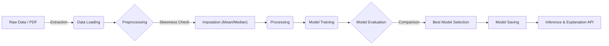

# 🏥 Life Expectancy Forecasting System


**An end-to-end Machine Learning Pipeline designed to predict life expectancy with high precision and explainability.**

This project demonstrates a robust, production-ready ML workflow that automates the entire lifecycle of model development—from raw data ingestion to deployment via a RESTful API. It now includes advanced features like PDF data extraction using Gemini AI, model explainability using SHAP, and Data Version Control (DVC).

---

## 🚀 Pipeline Architecture

The system implements a modular **ETL & ML Pipeline** approach:



### 1. 🧹 Advanced Data Preprocessing & Analysis
The data cleaning process is rigorous and automated, ensuring high data quality before modeling.
- **Handling Missing Values**:
    - Rows with missing 'Life Expectancy' are dropped to maintain ground truth integrity.
    - Other missing values are intelligently imputed based on data distribution (Mean vs Median).
- **Feature Correlation Analysis**:
    - A correlation heatmap is generated to visualize relationships between diverse features, guiding feature selection.

### 2. 🤖 Multi-Model Training Strategy
The pipeline trains and compares a suite of regression algorithms to find the optimal fit:
- **Linear Models**: `Linear Regression`, `Ridge`, `Lasso` (Baselines).
- **Tree-Based Models**: `Random Forest` (High accuracy).
- **Advanced Boosting**: `XGBoost` (State-of-the-art performance).

### 3. 🧠 Model Explainability & PDF Extraction
- **SHAP (SHapley Additive exPlanations)**: The system doesn't just predict; it explains *why*. Every prediction comes with a breakdown of positive and negative factors influencing the life expectancy score.
- **Gemini AI Integration**: Users can upload PDF reports containing health indicators. The system uses Google's Gemini AI to extract structured data from these unstructured documents automatically.

### 4. 🗂️ Data Version Control (DVC)
- **Data Provenance**: Uses DVC to track versions of datasets (`.dvc` files), ensuring reproducibility of experiments.
- **Pipeline Management**: Manages data dependencies and pipeline stages, allowing for team collaboration on data science projects.

---

## 🛠️ Project Structure

Designed for scalability and maintainability, featuring a **Singleton Model Manager** for efficient resource handling.

```bash
life_expectancy_forecasting_system/
├── 📂 pipelines/             # Core ML Logic
│   ├── data_loader.py       # Data Ingestion & Splitting
│   ├── data_preprocessing.py# Feature Engineering & Imputation
│   └── train.py             # Model Training & Auto-Selection Factory
├── 📂 services/              # Business Logic Layer
│   ├── ml_pipeline_service.py # Orchestrator
│   ├── prediction_service.py  # Inference Logic
│   ├── data_extraction_service.py # PDF Extraction via Gemini
│   └── model_manager.py     # Singleton for Model/Explainer Management
├── 📂 routes/                # API Interface
│   ├── ml_pipeline_route.py # Training Endpoints
│   └── predict_route.py     # Prediction Endpoints
├── 📂 data/                  # Data Storage
│   ├── train.csv            # Raw Dataset
│   └── cleaned_dataset.csv  # Processed Dataset
├── 📂 models/                # Model Storage
│   └── best_model.pkl       # Serialized Best Model
├── 📂 utils/                 # Helpers (Logger, Config)
└── main.py                  # Application Entrypoint
```

---

## ⚡ Quick Start

### Prerequisites
- Python 3.10+
- pip
- Google Gemini API Key (for PDF extraction)

### Installation

1.  **Clone the repository**
    ```bash
    git clone https://github.com/RAJ-Git18/life_expectancy_forecasting_system.git
    cd life_expectancy_forecast
    ```

2.  **Install Dependencies**
    ```bash
    pip install -r requirements.txt
    ```

3.  **Set Environment Variables**
    Create a `.env` file and add your Google API key:
    ```env
    GOOGLE_API_KEY=your_api_key_here
    ```

4.  **Run the Server**
    ```bash
    uvicorn main:app --reload
    ```

### 🧪 Triggering the Pipeline

You can trigger the full training pipeline via the API:

```bash
curl -X POST http://127.0.0.1:8000/ml-pipeline/train
```

### 🔮 Prediction & Explanation Workflow

1.  **Upload PDF Report**: The user uploads a PDF containing health and demographic indicators.
2.  **Automated Extraction**: The system uses **Google Gemini AI** to intelligent extract structured data from the unstructured PDF.
3.  **Model Inference**: The extracted data is passed to the **XGBoost** model.
4.  **SHAP Explanation**: The system calculates `life_expectancy` and explains the result.

**Example API Response:**

```json
{
  "life_expectancy": 64.71,
  "positive_factors": {
    "hiv/aids": 1.2,
    "population": 0.36,
    "polio": 0.31,
    "hepatitis_b": 0.16,
    "total_expenditure": 0.14,
    "thinness__1-19_years": 0.13,
    "infant_deaths": 0.11,
    "gdp": 0.07,
    "percentage_expenditure": 0.05,
    "thinness_5-9_years": 0.05
  },
  "negative_factors": {
    "adult_mortality": -2.54,
    "income_composition_of_resources": -1.95,
    "diphtheria": -0.55,
    "bmi": -0.39,
    "measles": -0.37,
    "schooling": -0.35,
    "alcohol": -0.23,
    "under-five_deaths": -0.21
  }
}
```

---

## 📈 Model Performance & Evaluation

The models were rigorously evaluated using **MSE (Mean Squared Error)**, **MAE (Mean Absolute Error)**, and **R² Score**. `XGBoost` emerged as the clear winner, demonstrating superior predictive capability.

| Model | MSE | MAE | R² Score | Verdict |
|-------|-----|-----|----------|---------|
| **Linear Regression** | 15.96 | 2.96 | 0.82 | Good Baseline |
| **Ridge Regression** | 15.96 | 2.96 | 0.82 | Consistent |
| **Lasso Regression** | 16.71 | 3.03 | 0.81 | Regularized Baseline |
| **Random Forest** | 3.06 | 1.11 | 0.96 | High Accuracy |
| **XGBoost** | **3.02** | **1.14** | **0.97** | **🏆 Best Performer** |

### Why XGBoost?
XGBoost (Extreme Gradient Boosting) outperformed other models due to its ability to capture complex, non-linear relationships in the data. Its boosting mechanism iteratively corrects errors from previous trees, resulting in a highly optimized model with an R² score of **0.97**, explaining 97% of the variance in life expectancy.

---

## 📝 Technologies Used

- **FastAPI**: High-performance web framework for building APIs.
- **Scikit-Learn**: For classical ML algorithms and evaluation metrics.
- **XGBoost**: For gradient boosting.
- **SHAP**: For model interpretability.
- **Google Gemini**: For intelligent document data extraction.
- **Pandas/NumPy**: For efficient data manipulation.
- **Joblib**: For model serialization.

---

## Contributing

Feel free to fork this repository, open issues, or submit pull requests.

*Done by Raj Simkhada*
