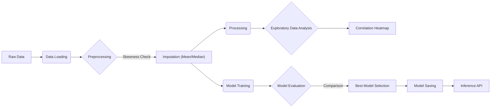
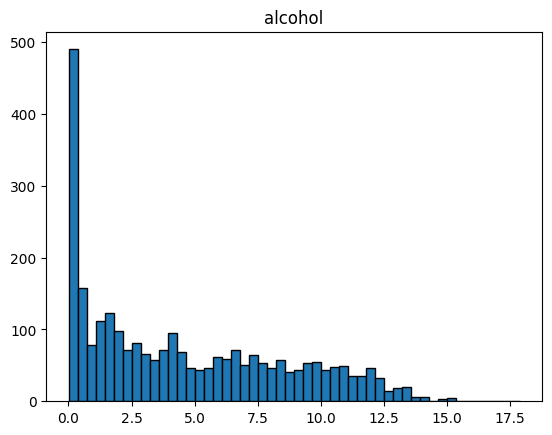
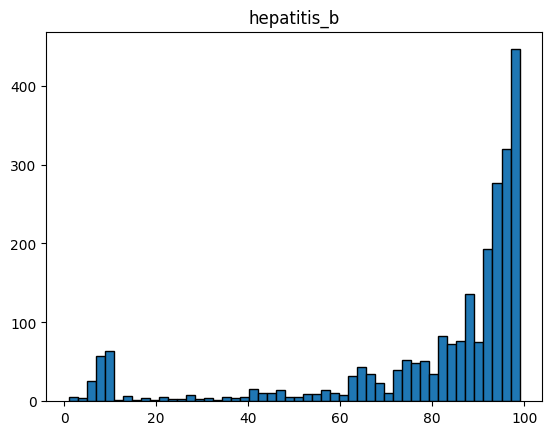
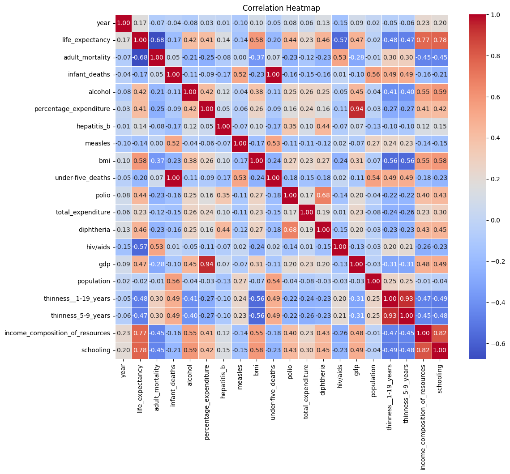

# 🏥 Life Expectancy Forecasting System


**An end-to-end Machine Learning Pipeline designed to predict life expectancy with high precision.**

This project demonstrates a robust, production-ready ML workflow that automates the entire lifecycle of model development—from raw data ingestion to deployment via a RESTful API.

---

## 🚀 Pipeline Architecture

The system implements a modular **ETL & ML Pipeline** approach:



### 1. 🧹 Advanced Data Preprocessing & Analysis
The data cleaning process is rigorous and automated, ensuring high data quality before modeling.
- **Handling Missing Values**:
    - Rows with missing 'Life Expectancy' are dropped to maintain ground truth integrity.
    - Other missing values are intelligently imputed based on data distribution (Mean vs Median).
      
      <div align="center">
      
      
      
      </div>

- **Feature Correlation Analysis**:
    - A correlation heatmap is generated to visualize relationships between diverse features, guiding feature selection.
      <div align="center">
      
      </div>

### 2. 🤖 Multi-Model Training Strategy
The pipeline trains and compares a suite of regression algorithms to find the optimal fit:
- **Linear Models**: `Linear Regression`, `Ridge`, `Lasso` (Baselines).
- **Tree-Based Models**: `Random Forest`, `Gradient Boosting` (High accuracy).
- **Advanced Boosting**: `XGBoost` (State-of-the-art performance).

### 3. 📊 Automated Evaluation & Selection
- **Metrics**: Evaluates using **MSE** (Mean Squared Error), **MAE** (Mean Absolute Error), and **R² Score**.
- **Champion/Challenger**: Automatically promotes the model with the highest R² score to production.

---

## 🛠️ Project Structure

Designed for scalability and maintainability:

```bash
life_expectancy_forecasting_system/
├── 📂 pipelines/             # Core ML Logic
│   ├── data_loader.py       # Data Ingestion & Splitting
│   ├── data_preprocessing.py# Feature Engineering & Imputation
│   └── train.py             # Model Training & Auto-Selection Factory
├── 📂 services/              # Business Logic Layer
│   └── ml_pipeline_service.py # Orchestrator avoiding circular dependencies
├── 📂 routes/                # API Interface
│   └── ml_pipeline_routes.py# FastAPI Endpoints
├── 📂 data/                  # Data Storage
│   ├── life_expentency_dataset.csv         # Raw Dataset
│   └── life_expentency_cleaned_dataset.csv # Processed Dataset
├── 📂 assets/                # Images and static assets
└── 📂 utils/                 # Helpers (Logger, Config)
```

**Notebooks for Exploration:**
- `life_expentency_data_cleaning.ipynb`: Deep dive into data cleaning & EDA.
- `model.ipynb`: Prototyping and initial model evaluation.

---

## ⚡ Quick Start

### Prerequisites
- Python 3.10+
- pip

### Installation

1.  **Clone the repository**
    ```bash
    git clone https://github.com/RAJ-Git18/life_expectancy.git
    cd life_expectancy_forecast
    ```

2.  **Install Dependencies**
    ```bash
    pip install -r requirements.txt
    ```

3.  **Run the Server**
    ```bash
    uvicorn main:app --reload
    ```

### 🧪 Triggering the Pipeline

You can trigger the full training pipeline via a simple curl command:

```bash
curl -X POST http://127.0.0.1:8000/api/v1/ml-pipeline/train
```

**Expected Output:**
```json
{
  "status": "success",
  "message": "ML Pipeline Completed Successfully."
}
```

---

## 📈 Results Breakdown

The models were evaluated using the R² score, with **XGBoost** and **Random Forest** emerging as the top performers.

| Model | R² Score | Verdict |
|-------|----------|---------|
| Linear Regression | 0.8463 | Good Baseline |
| Ridge Regression | 0.8462 | Consistent Performance |
| Lasso Regression | 0.8241 | Regularized Baseline |
| **Random Forest** | **0.9660** | **High Accuracy** |
| **XGBoost** | **0.9670** | **🏆 Best Performer** |

---

## 📝 Technologies Used

- **FastAPI**: High-performance web framework for building APIs.
- **Scikit-Learn**: For classical ML algorithms and evaluation metrics.
- **XGBoost**: For gradient boosting framework.
- **Pandas/NumPy**: For efficient data manipulation.
- **Joblib**: For model serialization and persistence.

---

## Contributing

Feel free to fork this repository, open issues, or submit pull requests.

*Built with ❤️ by Raj Simkhada*
